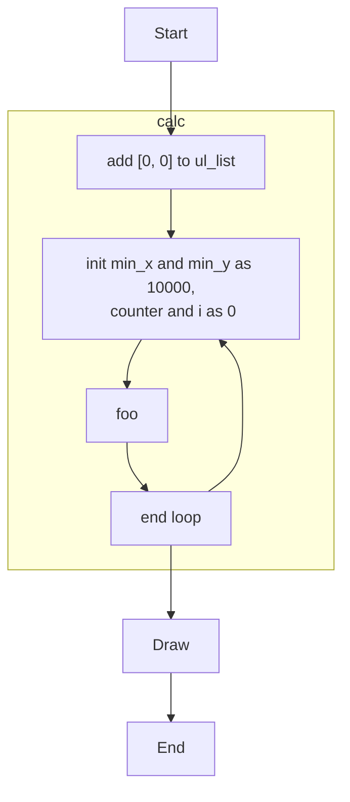

# mosaidom

```mermaid
graph TB
  Start[Start] --> CalcInit["add [0, 0] to ul_list"]
  subgraph calc
    CalcInit --> LoopInit[init min_x and min_y as 10000,<br> counter and i as 0]
    LoopInit --> foo
    foo --> EndLoop
    EndLoop[end loop] --> LoopInit
    end
  EndLoop --> Draw

  Draw --> End[End]
```
