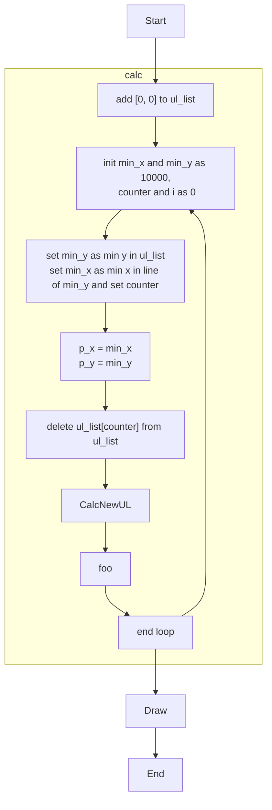

# mosaidom

```mermaid
graph TB
  Start[Start] --> CalcInit["add [0, 0] to ul_list"]
  subgraph calc
    CalcInit --> LoopInit[init min_x and min_y as 10000,<br> counter and i as 0]
    LoopInit --> SetMinXY["set min_y as min y in ul_list<br>set min_x as min x in line of min_y and set counter"]
    SetMinXY --> ULPointNow["p_x = min_x<br>p_y = min_y"]
    ULPointNow --> DeleteUL["delete ul_list[counter] from ul_list"]
    DeleteUL --> CalcNewUL
    CalcNewUL --> foo
    foo --> EndLoop
    EndLoop[end loop] --> LoopInit
    end
  EndLoop --> Draw

  Draw --> End[End]
```
